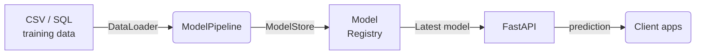

# notebook-to-prod — Property Valuation Pipeline & API 🚀  

  

A production-grade reference project that turns an exploratory Jupyter notebook into a **fully-automated ML pipeline** plus a **secure, cloud-agnostic FastAPI service** for property-price predictions. The repo follows cutting-edge MLOps practices—config-driven code, strict data validation, MLflow registry, and one-command Docker workflows—so future models can be swapped-in with minimal effort.

---

## Table of contents
1. [Feature highlights](#feature-highlights)  
2. [Architecture](#architecture)  
3. [Getting started](#getting-started)  
4. [Installation](#installation)  
5. [Usage](#usage)  
6. [Configuration reference](#configuration-reference)  
7. [Project layout](#project-layout)  
8. [Development](#development)  
9. [Model registry (MLflow)](#model-registry-mlflow)  
10. [Assumptions](#assumptions)  
11. [Roadmap / future work](#roadmap--future-work)  
12. [Contributing](#contributing)  
13. [Acknowledgements](#acknowledgements)

---

## Feature highlights
* **End-to-end pipeline** – training → evaluation → MLflow versioning → online inference  
* **Pydantic schemas** – shared by training & API; prediction path disables coercion for extra safety  
* **Config-first design** – all knobs live in `.env` or CLI flags (class-based settings)  
* **FastAPI with API-Key security** – header `X-API-Key`, plus structured logging of every call  
* **Strict data validation** – row-wise checks before fitting and type-safe runtime payloads  
* **Docker-native** – individual images for training & API
* **Makefile shortcuts** – `make train`, `make run-api`, `make mlflow` for local hacking  
* **Cloud agnostic** – works with local disk (`file:./mlruns`) or remote MLflow back-end  
* **Fully typed & linted** – Python 3.11, Ruff, and optional mypy ensure code quality

---

## Architecture



* **Training** (`training/main.py`) ingests data (CSV or SQL), fits a scikit-learn
  pipeline (`core/pipeline.py`), evaluates it (`training/evaluate.py`), and registers the artefacts.
* **Serving** (`api/main.py`) lazily loads the *latest* registered model once per process and exposes REST endpoints:  
  * `GET /health` liveness probe  
  * `GET /info` current model name & version  
  * `POST /predict` secured, validated prediction  

---

## Getting started

### Prerequisites
* Python ≥ 3.11  
* Docker & Docker Compose  
* Make (optional but convenient)

### Quick start — local

```bash
$ git clone https://github.com/your-org/notebook-to-prod.git
$ cd notebook-to-prod

# 1. Build images
$ make build-training
$ make build-api

# 2. Train & register a model (writes to ./mlruns)
$ make train DATA_PATH=/path/to/data.csv

# 3. Launch the API
$ make run-api  # http://localhost:8000/docs

# 4. Generate predictions
$ make predict PREDICT_FILE=/path/to/file.json
```

---

## Installation

```bash
# create & activate venv
$ python -m venv .venv && source .venv/bin/activate

# install training deps
$ pip install -r requirements.train.txt
# OR for inference only
$ pip install -r requirements.api.txt
```

Copy `.env.example` to `.env` and adjust values as needed:

```dotenv
API_KEY=replace-me
LOG_LEVEL=INFO
DEFAULT_MODEL_NAME=property-valuation-model
```

---

## Usage

### 1 · Training pipeline

```bash
$ python -m training.main --data-path data/my_properties.csv
```

Outputs  
* MLflow run under `./mlruns`  
* `artifacts/*.png` scatter & feature-importance plots  

Override settings on the fly:

```bash
$ DEFAULT_MODEL_NAME=gb-v2 LOG_LEVEL=DEBUG make train
```

### 2 · Evaluation

Open MLflow UI:

```bash
$ make mlflow  # → http://localhost:5000
```

### 3 · Serving predictions

Start server:

```bash
$ make run-api
```

Example request:

```bash
$ curl -X POST http://localhost:8000/predict        -H "X-API-Key: replace-me"        -H "Content-Type: application/json"        -d '{"surface_m2": 120, "bedrooms": 3, "bathrooms": 2,
            "year_built": 2010, "type": "apartment", "sector": "Providencia"}'
```

Response:

```json
{"price": 135000.0}
```

---

## Configuration reference

| Key | Default | Description |
| --- | --- | --- |
| `API_KEY` | *(none)* | Shared secret required in `X-API-Key` header |
| `DEFAULT_MODEL_NAME` | `property-valuation-model` | Name for newly trained models |
| `DEFAULT_MODEL_REGISTRY_URI` | `file:./mlruns` | MLflow Model Registry URI |
| `DEFAULT_MODEL_TRACKING_URI` | `file:./mlruns` | MLflow Tracking URI |
| `DEFAULT_SQL_CONNECTION` | `sqlite:///./data.db` | Fallback DB connection string |
| `DEFAULT_SQL_QUERY` | `SELECT * FROM my_table` | Query executed by `DataLoader` |
| `LOG_LEVEL` | `INFO` | Root log level for both CLI & API |

---

## Project layout

```text
notebook-to-prod/
├── api/                   # FastAPI application
│   └── main.py            # Main api script
├── core/                  # Shared business logic
│   ├── config.py          # Pydantic Settings
│   ├── pipeline.py        # Training & inference wrapper
│   ├── model.py           # MLflow helpers
│   ├── schemas.py         # Typed request/response models
│   └── validation.py      # Data validation utilities
├── training/              # Offline training CLI
│   ├── data.py            # Data loader interfaces
│   ├── evaluate.py        # Model evaluation wrapper
│   └── main.py            # Main training script
├── .env.template          # Template for .env file
├── basic-model.ipynb      # Input Jupyter Notebook
├── Dockerfile.api         # Inference container
├── Dockerfile.train       # Training container
├── Makefile               # DX helpers
├── pyproject.toml         # Lint/format config
├── README.md              # This file
├── requirements.api.txt   # API component's dependencies
└── requirements.train.txt # Training component's dependencies
```

---

## Development

```bash
# style & lint
$ ruff check .

# static typing (optional)
$ mypy .
```

Pre-commit hooks are recommended to automate the above checks.

---

## Model registry (MLflow)

* Tracking & registry URI defaults to `file:./mlruns`; switch to a remote store by changing
  `DEFAULT_MODEL_TRACKING_URI` / `DEFAULT_MODEL_REGISTRY_URI`.
* Promote the latest model manually:

```bash
$ mlflow models transition --model-name property-valuation-model --version 3 --stage Production
```

MLflow UI surfaces metrics, artefacts, and lineage for auditability.

---

## Assumptions

* `train.csv` and `test.csv` share the same distribution; the split may be repurposed for
  cross-validation or re-combined for a larger training set.  
* The provided basic notebook encodes domain knowledge already captured in `core/pipeline.py`;  
  hyper-parameter tuning is out-of-scope for the first production cut.  
* External observability (Prometheus, ELK, etc.) is future work; current logging is JSON-friendly.

---

## Roadmap / future work
* ✅ **CI/CD** – GitHub Actions pipeline for lint → test → build → push  
* 🔍 **Monitoring** – integrate Prometheus metrics & request tracing  
* 🏷️ **Model explainability** – SHAP values endpoint  
* ✨ **Feature store abstraction** – plug-in design ready, implementation pending  
* 🔒 **OAuth / JWT** – upgrade from static API key to multi-tenant auth  
* ⚡ **Performance** – experiment with LightGBM or XGBoost for faster inference  

---

## Contributing

1. Create a feature branch: `git checkout -b feat/short-title`  
2. Follow [Conventional Commits](https://www.conventionalcommits.org/) for messages.  
3. Ensure `ruff`, `mypy`, and `pytest` pass locally.  
4. Open a PR; GitHub Actions will run the same checks.

---

## Acknowledgements
* FastAPI & Pydantic teams for first-class developer UX  
* The MLflow open-source community  

> Crafted with ❤️ & strict typing.
